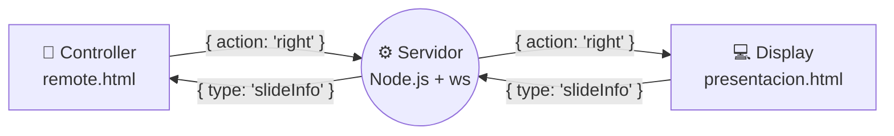

<div align="center">

# 📱 Reveal Remote

**Control remoto inalámbrico de baja latencia para presentaciones en reveal.js**

[]()
[]()
[]()
[]()
[](https://opensource.org/licenses/MIT)

Navegá tus *slides* desde el celular sin instalar dependencias. Escaneá el código QR, sincronizá el dispositivo en tiempo real y tomá el control absoluto de tu presentación.

</div>

---

## 📋 Tabla de contenidos

- [¿Qué es?](#-qué-es)
- [¿Cómo funciona?](#-cómo-funciona)
- [Demo incluida](#-demo-incluida)
- [Características](#-características)
- [Tecnologías](#-tecnologías)
- [Instalación y uso](#-instalación-y-uso)
- [Estructura del proyecto](#-estructura-del-proyecto)
- [Arquitectura](#-arquitectura)
- [Protocolo WebSocket](#-protocolo-websocket)
- [Personalizar para tu presentación](#-personalizar-para-tu-presentación)
- [Autores](#-autores)

---

## 🧐 ¿Qué es?

**Reveal Remote** es una solución *Zero-Configuration* diseñada para controlar presentaciones web basadas en [reveal.js](https://revealjs.com/). Utilizando un protocolo ligero sobre WebSockets, convierte cualquier dispositivo móvil conectado a la misma red local en un control remoto interactivo.

No requiere la instalación de aplicaciones de terceros; opera directamente desde el navegador del dispositivo móvil ofreciendo soporte para **D-Pad táctil**, **gestos de deslizamiento (swipe)** y **feedback háptico**.

---

## ⚙️ ¿Cómo funciona?

El sistema se basa en una arquitectura cliente-servidor mediada por WebSockets, donde tres actores principales interactúan en tiempo real con latencia mínima:



**Secuencia:**

1. El usuario ejecuta `node server/server.js` — el servidor se levanta en el puerto 3000
2. La PC abre `http://localhost:3000` — la presentación carga y se conecta al WebSocket como `display`
3. El celular escanea el QR que aparece en la presentación y abre `remote.html`
4. `remote.html` se conecta al WebSocket como `controller`
5. Cuando el usuario toca un botón o desliza el dedo, el celular envía `{ action: "right" }`
6. El servidor recibe el mensaje y lo reenvía al display
7. La presentación recibe `{ action: "right" }` y ejecuta `Reveal.next()`
8. La presentación responde con el estado actual: `{ type: "slideInfo", index: 3, total: 14, fragment: 2, totalFragments: 5 }`
9. El celular muestra el número de slide y actualiza la barra de progreso

---

## 🎮 Demo incluida

La presentación demo (`presentacion.html`) es una **charla técnica sobre el propio proyecto** e incluye:

- **11 diapositivas** que cubren problema, arquitectura, protocolo y stack
- Diagramas visuales de la arquitectura (controller ↔ server ↔ display)
- Explicación del protocolo WebSocket
- QR modal con animación de apertura

> 💡 El control remoto funciona con **cualquier presentación reveal.js**. Solo necesitás agregar el código WebSocket del lado del display.

---

## ✨ Características

* 📱 **Zero-Install Client:** Interfaz de control accesible vía web. Funciona en iOS y Android sin descargas.
* ⚡ **Comunicación Real-Time:** Sincronización instantánea de estado bidireccional mediante WebSockets.
* 🔗 **Pairing mediante QR:** Generación dinámica de códigos QR en el servidor para vinculación instantánea (Drop Animation UI).
* 👆 **Gestos Avanzados:** Detección de *swipes* con estela visual (*gesture trail*) y soporte para eventos de *long-press* (repetición a 80ms).
* 🔄 **Resiliencia de Red:** Estrategia de reconexión automática con *Exponential Backoff* (2s → 15s) e indicadores visuales de estado.
* 📊 **Telemetría de Presentación:** Refleja en el dispositivo móvil el progreso, número de *slide* y fragmentos activos.
* 🔌 **Single-Port Architecture:** El servidor HTTP estático y el servidor WebSocket conviven en el mismo puerto, evitando problemas de CORS.

---

## 🛠️ Tecnologías

| Tecnología               | Versión | Rol                                                  |
| ------------------------ | ------- | ---------------------------------------------------- |
| **Node.js**              | —       | Entorno de ejecución del servidor                    |
| **Express**              | ^5.2    | Servidor HTTP + routing                              |
| **ws**                   | ^8.21   | WebSocket server para relay                          |
| **reveal.js**            | ^6.0    | Framework de presentaciones (demo)                   |
| **qrcode**               | ^1.5    | Generación de QR server-side                         |
| **JavaScript (vanilla)** | —       | Cliente WebSocket en remote.html y presentacion.html |
| **HTML5 / CSS3**         | —       | Interfaz del control remoto y la presentación        |

---

## 🚀 Instalación y uso

### Requisitos

- [Node.js](https://nodejs.org/) (v16 o superior)
- Un navegador moderno en la PC
- Un celular en la misma red Wi-Fi

### Pasos

```bash
# 1. Clonar
git clone https://github.com/PierSoco/Reveal-Remote.git
cd Reveal-Remote

# 2. Instalar dependencias
npm install

# 3. Iniciar el servidor
node server/server.js
```

### Conectar

```
En la PC:
  → Abrí http://localhost:3000
  → Mové el mouse al borde superior de la pantalla

En el celular:
  → Escaneá el código QR que aparece en la presentación
  → O abrí http://<IP_DE_LA_PC>:3000/remote
```

## 📁 Estructura del proyecto

```
📦 Reveal-Remote/
├── 📁 server/
│   └── 📄 server.js              # Servidor HTTP + WebSocket + QR
├── 📁 public/
│   ├── 📄 presentacion.html      # Presentación demo (reveal.js) + QR modal
│   └── 📄 remote.html            # Control remoto para celular 📱
├── 📄 package.json               # Dependencias
└── 📄 README.md                  # Este archivo
```

---

## 🏗️ Arquitectura de Comunicación

El sistema implementa un modelo de paso de mensajes (Message Broker ligero) donde un servidor centralizado enruta los eventos entre el `Controller` (Mobile) y el `Display` (Host).

```mermaid
sequenceDiagram
    participant C as 📱 Controller (Celular)
    participant S as ⚙️ WebSocket Server (Node.js)
    participant D as 💻 Display (PC)

    Note over S: Servidor en puerto 3000
    D->>S: Conexión WS { type: "display" }
    Note over C: Escanea QR
    C->>S: Conexión WS { type: "controller" }
    S-->>D: Evento { type: "controller-connected" }
    
    rect rgb(30, 30, 30)
        Note over C,D: Flujo de Navegación
        C->>S: Comando { action: "right" }
        S->>D: Reenvía { action: "right" }
        D-->>S: Estado { type: "slideInfo", index: 3, fragment: 2 }
        S-->>C: Sincroniza { type: "slideInfo", index: 3, fragment: 2 }
    end
```



---
## 🔌 Especificación del Protocolo WS

La comunicación se basa en *payloads* JSON estrictos:

| Emisor | Receptor | Payload de Ejemplo | Descripción |
| :--- | :--- | :--- | :--- |
| **Display** | Server | `{ "type": "display" }` | Registra la sesión del presentador. |
| **Controller**| Server | `{ "type": "controller" }` | Registra el mando móvil. |
| **Controller**| Display | `{ "action": "right" }` | Comandos admitidos: `up`, `down`, `left`, `right`. |
| **Display** | Controller| `{ "type": "slideInfo", "index": 3, "fragment": 2 }` | Sincroniza el estado actual del *deck* al dispositivo móvil. |

---

## 🛠️ Integración con tu Presentación

El proyecto incluye una demostración técnica interactiva en `presentacion.html`. 

Si querés implementar Reveal Remote en **tu propio entorno reveal.js**, simplemente inyectá este *snippet* antes del cierre de la etiqueta `</body>`:

```html
<script>
  (function() {
    const ws = new WebSocket('ws://' + window.location.host);
    
    ws.onopen = () => ws.send(JSON.stringify({ type: 'display' }));
    
    ws.onmessage = (e) => {
      const msg = JSON.parse(e.data);
      if (msg.type === 'controller-connected') {
        // Hook opcional: Ejecutar animaciones, cerrar modales, etc.
        console.log("Controlador vinculado.");
      } else if (msg.action) {
        const actions = {
            'right': () => Reveal.right(),
            'left':  () => Reveal.left(),
            'up':    () => Reveal.up(),
            'down':  () => Reveal.down()
        };
        if (actions[msg.action]) actions[msg.action]();
      }
    };

    function syncState() {
      const indices = Reveal.getIndices();
      const currentSlide = Reveal.getCurrentSlide();
      const fragmentCount = currentSlide ? currentSlide.querySelectorAll('.fragment').length : 0;
      
      ws.send(JSON.stringify({
        type: 'slideInfo',
        index: indices.h + 1,
        total: Reveal.getTotalSlides(),
        fragment: indices.f >= 0 ? indices.f + 1 : 0,
        totalFragments: fragmentCount
      }));
    }

    Reveal.addEventListener('ready', syncState);
    Reveal.addEventListener('slidechanged', syncState);
    Reveal.addEventListener('fragmentshown', syncState);
    Reveal.addEventListener('fragmenthidden', syncState);
  })();
</script>
```

---

## 👥 Autores

- **Socodober Pierre** — [GitHub](https://github.com/PierSoco)

Pull requests y reportes de issues son siempre bienvenidos.

---

## 📄 Licencia

Distribuido bajo la Licencia MIT. Podés utilizar, modificar y distribuir este software de forma libre en proyectos personales o comerciales.

---

<div align="center">
  <a href="https://github.com/PierSoco/Reveal-Remote">github.com/PierSoco/Reveal-Remote</a>
</div>
